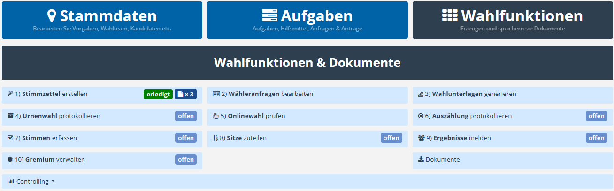

# Wahlfunktionen

Die Wahlfunktionen, auch als **WFU** bezeichnet, basieren auf den im System hinterlegten Vorgaben und Stammdaten. Neben Abfragemöglichkeiten (Wählerservice, Wähleranfragen bearbeiten) entstehen hier die für die Wahlakte notwendigen Dokumentationen.

*Übersicht der Wahlfunktionen (WFU)*

| **Wahlfunktion** | **Zweck** |
| --- | --- |
| **WFU1 Wahlvorschläge u Stimmzettel erstellen** | Erzeugen Sie Aushänge für Wahlvorschläge und generieren Sie Stimmzettel im gewünschten Layout. Geben Sie Stimmzettel schließlich für Druck- und Produktion frei. |
| **WFU2 Wähleranfragen bearbeiten** | Das Wählerservice-Modul dient als elektronisches Äquivalent für die papierhafte Wählerliste. Hier können Sie Auskunft erteilen über das Wählerverzeichnis, Briefwahlanträge entgegennehmen und bearbeiten. Hier verbuchen die Wahlteilnahme und prüfen die Wahlberechtigung. |
| **WFU3 Wahlunterlagen generieren** | Diese Wahlfunktion dient dazu, Seriendrucke zur Beantwortung von Wahlanträgen zu erzeugen und deren erfolgreichen Versand zu vermerken. |
| **WFU4 Urnenwahl protokollieren** | Die Tätigkeit im Wahlbüro muss protokoliert und dokumentiert werden. Dieses Modul erleichtert das. |
| **WFU5 Onlinewahl prüfen** | In diesem Modul haben Sie – je nach Privilegien - Einblick in die Aktivität und den Zustand von Online-Wahlen. |
| **WFU6 Auszählung protokollieren** | Die Auszählung der Wahlurnen muss protokolliert werden. Diese Funktion stellt Arbeitshilfen bereit, sowie entsprechende Protokollvorlagen. |
| **WFU7 Stimmen erfassen** | In diesem Schritt werden die ausgezählten Stimmen je Kandidat, Bezirk und nach Wahlkanal erfasst. Entsprechende Eingabemasken und Protokollvorlagen stehen bereit. |
| **WFU8 Sitze zuteilen** | Durch die Erfassung der Stimmen ist nun eine natürliche Rangfolge der Kandidaten entstanden. Nun erfolgt die Sitz-Zuteilung in das Gremium. Der Wahlvorstand kann z.B. bei Stimmgleichheit einwirken oder eventuelle Quoren berücksichtigen. Auch hier entsteht ein Protokoll. |
| **WFU9 Ergebnisse melden** | Nun Liegen alle Informationen vor. Stimmen, Sitze und statistische Berechnungen erfahren keine weiteren Änderungen mehr. Es kann ein abschießendes Protokoll sowie formelle Mitteilungen zum Versand an Dritte erstellt werden. |
| **WFU10 Gremium verwalten** | Nach Abschluss der Wahl, muss das Gremium konstituiert werden. Neben den durch die Wahl bestimmten Gremienmitgliedern, die automatisch übernommen werden, können auch weitere Personen hinzugefügt werden, sofern sie gemäß den jeweiligen Statuten einen Anspruch auf einen Sitz im Gremium haben (bspw. leitende Pfarrer oder entsendete Mitglieder). |
| **Dokumente** | Hier erhalten Sie Zugriff auf alle erzeugten und gespeicherten Dokumente zu Ihrem Standort. |
| **Controlling** | Hier gibt es Statistik-Informationen z.B. über die Auslastung und Nutzung der Wahllokale. |

**Hinweis:** Die Verfügbarkeit der einzelnen Wahlfunktionen richtet sich danach, welche **Wahlkanäle** an Ihrem Standort aktiviert sind. Ist beispielsweise **keine Urnenwahl** vorgesehen, steht die Wahlfunktion **4) „Urnenwahl protokollieren“** nicht zur Auswahl.

<!-- doccards:auto -->
## In diesem Kapitel

<DocCardList />

<!-- videos:auto -->
## Videos zu diesem Kapitel

### Wahlfunktionen allgemein

<Vimeo id="1080079395" title="Wahlfunktionen allgemein" />

Wiederkehrende Werkzeuge: Arbeitshilfen, Plausibilitätsmodul, Listen, Kommentare, Status.

### WFU1 – Wahlvorschläge und Stimmzettel erstellen

<Vimeo id="1095842650" title="WFU1 – Wahlvorschläge und Stimmzettel erstellen" />

Stimmzettel erzeugen, im gewünschten Design generieren und für den Druck freigeben.

### WFU2 – Wähleranfragen bearbeiten

<Vimeo id="1087930171" title="WFU2 – Wähleranfragen bearbeiten" />

Wähleranfragen strukturiert bearbeiten, inkl. Prüfungen und Wahlteilnahme.

### Wählerservice

<Vimeo id="1101805055" title="Wählerservice" />

Abgrenzung zwischen Wählerservice und Wahlfunktion 2.

### WFU3 – Wahlunterlagen generieren

<Vimeo id="1087930283" title="WFU3 – Wahlunterlagen generieren" />

Wahlunterlagen als Seriendruck erstellen und den Versand dokumentieren.

### WFU4 – Urnenwahl protokollieren

<Vimeo id="1095528250" title="WFU4 – Urnenwahl protokollieren" />

Wahlprotokolle vorbereiten, ausfüllen und als unterzeichnete Dokumente hochladen.

### WFU5 – Onlinewahl prüfen

<Vimeo id="1095852860" title="WFU5 – Onlinewahl prüfen" />

Reine Ansichtsfunktion zur Einsicht der Onlinewahlergebnisse.

### WFU6 – Auszählung protokollieren

<Vimeo id="1095528383" title="WFU6 – Auszählung protokollieren" />

Urnenöffnung und Auszählung je Bezirk dokumentieren.

### WFU7 – Stimmen erfassen

<Vimeo id="1095528463" title="WFU7 – Stimmen erfassen" />

Stimmen je Bezirk und Wahlkanal erfassen und zuordnen, Protokolle erzeugen.

### WFU8 – Sitze zuteilen

<Vimeo id="1095842718" title="WFU8 – Sitze zuteilen" />

Sitze nach Rangfolge zuteilen, manuelle Anpassungen, Protokoll erstellen.

### WFU9 – Ergebnisse melden

<Vimeo id="1095842810" title="WFU9 – Ergebnisse melden" />

Abschließende Dokumentation und Übermittlung der Wahlergebnisse.

### Dokumente

<Vimeo id="1095852942" title="Dokumente" />

Alle erzeugten und hochgeladenen Dokumente des Standorts mit Filterfunktionen.
